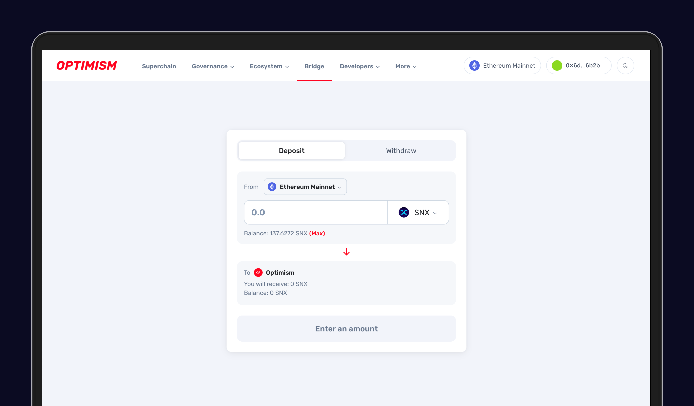

# Automating Staking Tasks

Synthetix has partnered with Gelato to enable stakers to automate staking-related tasks. Some of the tasks that can be automated are - claiming rewards, minting max (to stake additional SNX), and burning (to unstake some SNX, and raise your c-ratio).&#x20;

Automation functionality can be enabled using the Synthetix Delegate function, which has been a part of the system since the release of SIP-10 in March 2020. Gelato bots cannot control your staking account; they can only claim rewards on your behalf by utilizing the delegate function.

## #1 - Automated Claiming

Let us explore a quick example to understand how automated claiming through Gelato works:

* If at any point during the week, you exceed the target c-ratio, the automated claiming bot will claim your rewards.
* If you are below the target c-ratio and burn sUSD manually to increase your C-Ratio above the target, automated claiming will claim your rewards.
* If your account never exceeds the target c-ratio, the automated claiming bot WILL NOT claim your rewards.

Below is an example of a wallet currently using the automated claiming bot through Gelato -&#x20;

### Setup Guide - Claiming

* Deposit funds to your [Gelato Account](https://app.gelato.network/funds). These funds will be used to pay for transactions tha claim on your behalf. Recommended Value is $20-25 as Optimism transactions only cost approximately $.50

<figure><figcaption></figcaption></figure>

* Create a Task on Gelato by clicking the "Create Task" button

<figure><figcaption></figcaption></figure>

* Use `0xaAd3a6178d741DEA76F57901FeeDaC0f7Bb280E5` as the contract address

<figure><figcaption></figcaption></figure>

* Click "Select a function" and then select "Claim"

<figure><figcaption></figcaption></figure>

* Put your address into the "address" line

<figure><figcaption></figcaption></figure>

* Click "Whenever Possible" to ensure that the contract checks if you're eligible for rewards all the time. If this isn't selected, then it may miss eligible rewards.

<figure><figcaption></figcaption></figure>

* Name your task and finish creating it.
* Once you're done, now you'll need to delegate only claiming rights to the Gelato contract, accessible as msg.sender once the task is created, on[https://staking.synthetix.io/delegate](https://staking.synthetix.io/delegate).

<figure><figcaption></figcaption></figure>

* That's it; you're done!

## #2 - Automated Claiming with Burning to Claim

If you are below the target and have enough sUSD in your wallet to burn to the target, Gelato will burn sUSD and then claim your pending SNX rewards.

Although this feature is useful, it is not required. To enable automated claiming with burn to claim, see below.

### Setup Guide - Claim with Burn to Claim

* Use the same setup guide, but instead of "Claim," use the function "Burn and Claim" and delegate the ability to burn alongside claim to the gelato address.
* That's it!
