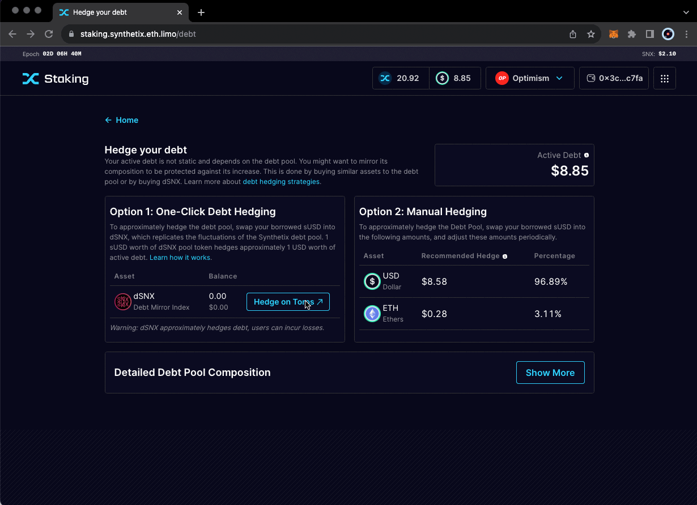

# Simplified Debt Hedging

**Introduction to One-Click Debt Hedging**

Synthetix collaborates with dHEDGE to offer a straightforward solution for debt hedging via a one-click debt mirror index. This tool, specifically designed for SNX stakers on the Optimism network, simplifies the process of hedging against debt pool exposure.

#### How to Use the One-Click Hedging Tool

* **Accessing the Tool**: Visit the [Synthetix Staking dapp debt section](https://staking.synthetix.io/debt) to start the process.
* **Purchasing dSNX Token**: In the user interface, select "Hedge on Toros" to buy the dSNX token.
* **Hedging Ratio**: One sUSD worth of the dSNX token hedges an equivalent amount of your sUSD debt.

<figure><figcaption></figcaption></figure>

#### Practical Example

* **Hedging your Debt**: If you have an active debt of 100,000 sUSD, purchasing 100,000 sUSD worth of the dHEDGE debt mirror index token will approximately align your debt with the movements of the overall debt pool, minimizing the need for active management.

#### Withdraw from dHEDGE (to burn sUSD)

* **Process**: To withdraw from the hedging strategy, go to [Toros Finance](https://toros.finance/derivative/dsnx) and select the 'Sell' button to sell your dSNX tokens.

#### Alternative Hedging Strategies

* **Other Options**: While the dHEDGE dSNX tool offers a convenient method to ensure parity between issued and active debt, it's not the sole strategy available. SNX stakers may explore other methods.
