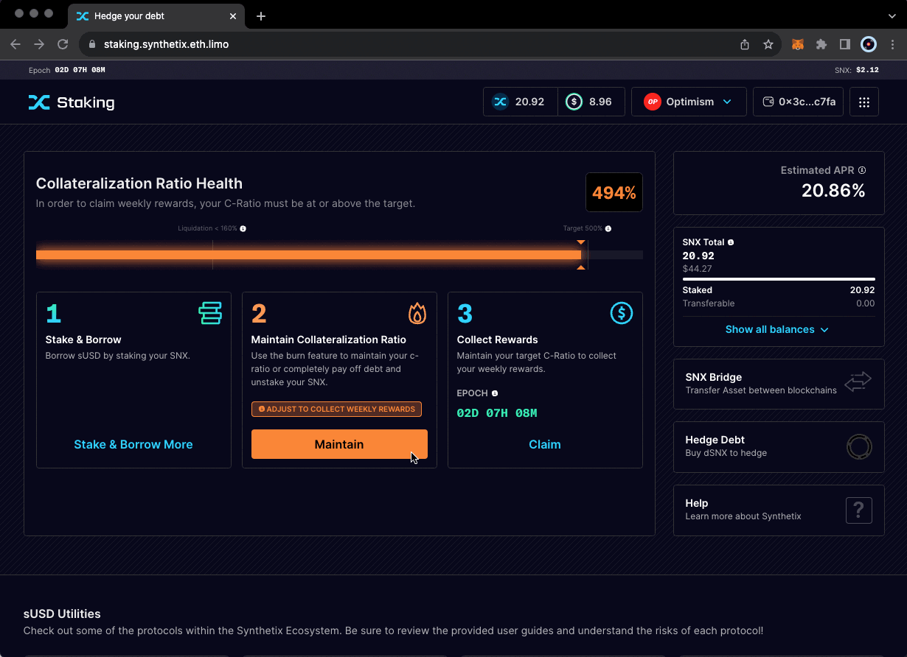

# Debt, Minting, and Burning Explained

### Debt, Minting, and Burning SNX - A Quick Summary

* **Active debt** is your share of the global debt pool, which changes with the composition of the debt pool. View the current debt pool composition at [https://staking.synthetix.eth.limo/debt/overview](https://staking.synthetix.eth.limo/debt/overview).
* **Issued Debt** refers to the initial value of sUSD issued when you stake SNX.
* **Minting** involves creating sUSD by locking SNX as collateral (staking), which increases your active debt.
* **Burning** is the opposite of minting, as it destroys sUSD and removes debt from the system, decreasing your active debt.
* Burning increases your C-Ratio, allowing you to claim rewards and transfer SNX.

### Minting and Burning - A Deeper Explanation

<figure><figcaption></figcaption></figure>

**Minting** is the process of creating synths (sUSD) with an associated debt obligation, collateralized by SNX.

**Burning** involves destroying synths (sUSD) and reducing the associated debt obligation by an equal value, unstaking SNX, and burning sUSD.

A staker cannot claim their epoch rewards if their account C-Ratio is below the target C-Ratio. In this situation, they would burn sUSD to increase their C-Ratio. Conversely, if a staker's C-Ratio is higher than the target C-Ratio during an epoch snapshot, they are not using their SNX collateral to its full potential, as some SNX are not being used/staked for collateralization. In this case, an SNX staker would mint sUSD by staking more SNX.

### Active Debt

Active debt represents a staker's debt owed to the global debt pool, expressed in USD. When sUSD is minted (and SNX staked), issued debt is assigned to the staker's account in sUSD. Active debt is a dynamic variable that constantly changes with the movements of the global debt pool.

As traders become more profitable, the global debt pool increases in value, as does the active debt of stakers. Conversely, when traders are less profitable, the global debt pool decreases in value, along with active debt.

### The Importance of Active Debt

Active debt signifies the stakers' share of the debt pool obligation. It is crucial not to overlook this variable, as stakers must eventually repay this debt to unlock their SNX collateral.

Debt hedging strategies that mimic the overall debt pool are the safest way for stakers to ensure their active debt aligns with their issued debt. Interested in automatic hedging? dHEDGE, a Synthetix partner, recently released a one-click debt hedging solution on Optimism. [Read more](https://blog.synthetix.io/dhedge-debt-mirror-index-token-2/).
