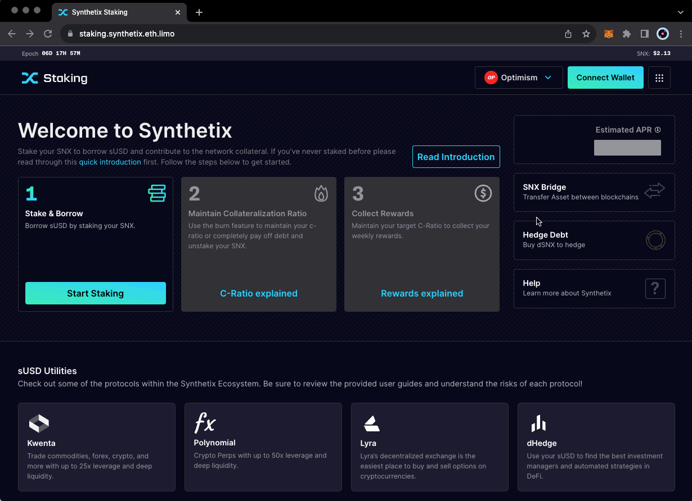

# Steps for Claiming Rewards

Informational Guide

* You will only receive rewards if you are staked before the weekly snapshot (Wednesday).
* To receive maximum rewards, ensure you are close to the target c-ratio. You can do this by minting max on the [staking menu](https://staking.synthetix.io/staking).
* Claimed SNX rewards are escrowed for one year. You won't be able to transfer or sell them during this time, though they will be automatically staked.
* sUSD fees are [burned weekly](https://blog.synthetix.io/the-schedar-release-fee-burn/) and do not need to be claimed; they will reduce your debt each week.

### Step-by-Step Claiming Guide

<figure><figcaption>
Claim your rewards
</figcaption></figure>

1. Click "Claim your rewards."
2. Click "Claim Synthetix Staking Rewards" and confirm the subsequent wallet transaction.
   * Note that sUSD rewards are automatically burned each Wednesday, while liquidation rewards do not expire but must be claimed to begin vesting. Neither of these rewards expire.
3. Unable to claim? That means your C-Ratio is below the target ratio. You can raise your C-Ratio by burning sUSD or staking more SNX. - [https://staking.synthetix.eth.limo/staking/burn](https://staking.synthetix.eth.limo/staking/burn)
