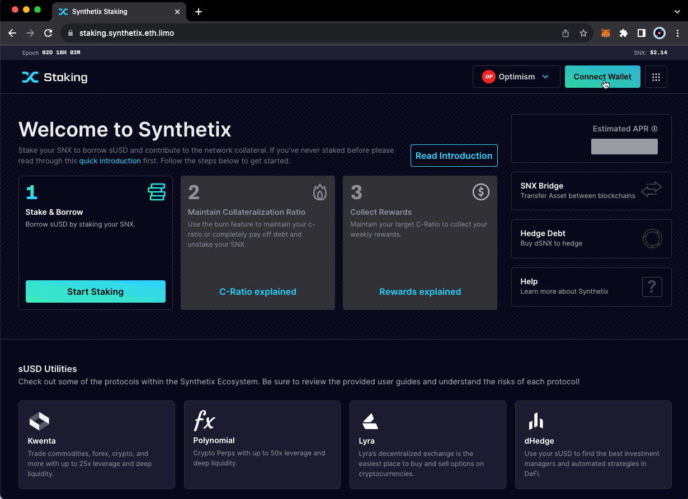

# Steps for Staking SNX (via Minting)

**Staking on Optimistic Ethereum**

1. **Transfer SNX to a Compatible Wallet**: Use wallets like MetaMask, Frame, Trezor, Ledger, Coinbase Wallet, Rainbow Wallet, or other Wallet Connect-supported wallets.
2. **Bridge Your SNX to Optimistic Ethereum**: Transfer SNX from Ethereum Mainnet to Optimistic Ethereum using the [Optimism Bridge](https://app.optimism.io/bridge).

<figure><figcaption></figcaption></figure>

1. **Visit the Staking Site**: Go to [staking.synthetix.eth.limo](https://staking.synthetix.eth.limo/) and connect your wallet.
2. **Connect to the Optimism Network**: Ensure your wallet is connected to Optimistic Ethereum. Visit [https://chainlist.org/](https://chainlist.org/) to add the network.
3. **Bridge Ethereum for Gas Fees**: Bridge Ethereum through the [Optimism Gateway](https://gateway.optimism.io/) for fees on Optimism.
4. **Stake Your SNX on Optimism**: Use the "Stake & Borrow More" button on the [Synthetix Staking app](https://staking.synthetix.eth.limo/) to stake your SNX.

<figure><figcaption></figcaption></figure>

## **Staking on Ethereum Mainnet**

1. **Transfer SNX to a Compatible Wallet**: Same as above.
2. **Be on the Ethereum Mainnet**: Ensure your wallet is set to ETH mainnet and that the dapp is as well. No bridging is required if your SNX tokens are already on mainnet.
3. **Visit the Staking Site**: Navigate to the Synthetix staking platform.
4. **Stake Your SNX on Mainnet**: Follow the same process to stake SNX, but on the Ethereum Mainnet version of the platform.

#### Important Note: Locked SNX Due to Staking & Minting

* **Lock Period**: When you stake SNX or mint additional sUSD, there is a mandatory lock period of 7 days.
* **Restrictions During Lock Period**: During this time, you cannot burn your staked SNX or reduce your sUSD debt beyond the target collateralization ratio (c-ratio).
* **Applies to Both Networks**: This lock-in rule applies for staking on Optimistic Ethereum and Ethereum Mainnet.
