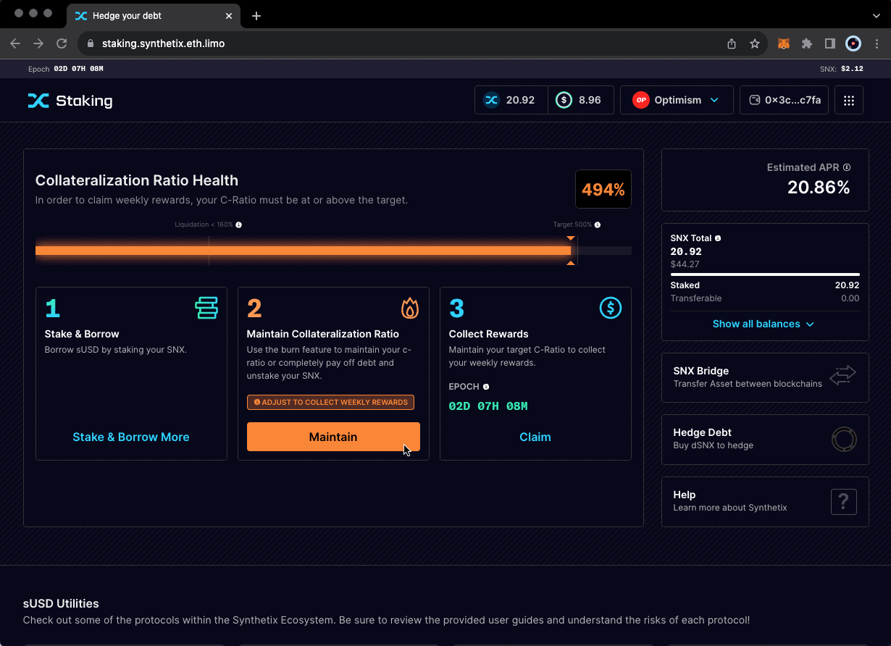

# Steps for Unstaking SNX (via Burning)

#### Steps for Partially Unstaking SNX (via Burning a Portion of Debt)

1. **Visit the Staking Site**: Go to [staking.synthetix.eth.limo](https://staking.synthetix.eth.limo/).
2. **Access the Staking Menu**: Navigate to the staking menu and select the 'Maintain Collateralization Ratio' option.
3. **Burn a Portion of Your Debt**: This action will direct you to the staking burn menu where you can choose how much sUSD debt to burn. This process will partially unstake your SNX. This may be necessary to enable claiming, as you'll need to be at the target to claim SNX rewards.

<figure><figcaption></figcaption></figure>

**Note on Escrowed SNX**: Remember, you cannot unstake SNX that is currently in escrow. Check your escrow and vesting schedule for details on when these tokens will become available.

#### Steps for Fully Unstaking SNX (via Burning All Debt)

1. **Visit the Staking Site**: Navigate to [staking.synthetix.eth.limo](https://staking.synthetix.eth.limo/).
2. **Access the Staking Burn Menu**: Go to the staking menu and choose the 'Maintain Collateralization Ratio' function to reach the burn menu.
3. **Burn All Active Debt**: To fully unstake your SNX, you must burn all of your active sUSD debt. Ensure you have sufficient sUSD in your wallet and select "Burn Max."

**Note on Escrowed SNX**: You can only withdraw SNX that is not in escrow. For information on the release of escrowed SNX, visit the escrow and vesting section.
