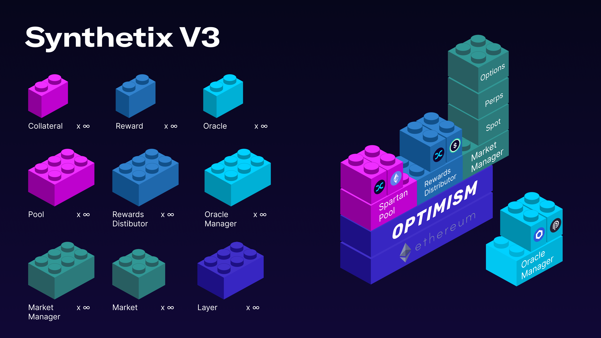

# Build on v3


v3 is still being rolled out, but now is the time to start building


<figure><figcaption></figcaption></figure>

As an introduction to Synthetix v3, what its capable of and deployment progress at time of posting, see the following blog post.


An outline of v3, its components and possibilities


## Intro

Synthetix v3 is a suite of financial primitives that enables anyone to pool collateral, build derivative markets (of any kind), and define how rewards can be distributed to stakeholders. This design allows developers to build custom market implementations for a wide range of financial instruments, such as spot tokens, perpetual futures, options, insurance, and any else, while utilizing the highest degree of decentralized technology currently available.

## v3 Components

_**Pools**: a collection of collateral that can be connected to one or more Markets, allowing its collateral to be delegated for use by the Market(s). The Market withdraws/deposits stablecoins from/into the Pool depending on its performance. Stakers can delegate their collateral to any Pool._

_**Oracle Manager**: accepts a range of onchain and offchain price oracles, which can be used by any Markets. The Oracle Manager is designed to agnostically accept a range of oracles, which currently include Chainlink and Pyth._&#x20;

_**Markets**: interact with Pools, Oracle Manager, users and the wider defi ecosystem. Markets typically perform a function, like a game, insurance market or perpetual futures market. A profitable Market would over time deposit more stable coins into the pool than it withdraws._

_**Rewards Distributor**: can be used by Pool owners to bootstrap or incentivise liquidity using additional tokens or earnings, separate to the Market’s performance depositing stablecoins._

## Why build on v3

Synthetix v3 solves the cold-start and scaling liquidity problems for derivate protocols. Synthetix is  an endless composable and configurable liquidity layer; backing whatever your Market needs to pay out, so you can scale faster, and LPs accrue more fees.

* Technical:&#x20;
  * Speed: It's trivial to create and configure Pools/Markets/Rewards
  * Security: v3 has been audited by both Open Zeppelin and Iosiro
* Product:&#x20;
  * Cold-start: Synthetix Stakers can allocate their collateral to your Pool in a few clicks
  * Scaling: Incentivize your own Pool, or attract existing Pools to back your Market

## v3 Playbook

1. Develop a new v3 Market, following [#example-v3-market](build-on-v3.md#example-v3-market "mention")
2. Setup a Pool, following [#example-v3-pool](build-on-v3.md#example-v3-pool "mention")
3. Propose your Pool becomes Approved via Spartan Council, so Stakers can deposit in your Pool
4. Encourage Stakers to Delegate their collateral to your Pool
5. Demonstrate your Market performance and Pool yield
6. Request other Pools to delegate collateral to your Market

## Example v3 Market

Here is an example implementation of a Number Guessing Game, implemented as a Market on v3.&#x20;


Example v3 Market


_Typically, a lottery implemented using a smart contract could not provide substantial prizes or consistent odds without first accumulating an adequate prize pool from numerous players. If it were to offer consistent odds or high payouts prematurely, the lottery would risk insolvency (i.e. be unable to pay out winners). Consequently, the initial players would be uncertain about the size of the potential prize and their odds of winning, so it would be hard to attract early players to address the first issue. This scenario exemplifies the "cold start liquidity" problem, which is relevant to all types of derivatives markets._

_A lottery game implemented with Synthetix can offer liquidity providers the ability to collect fees from ticket sales in exchange for providing collateral to be used in prize payouts if necessary. In this guide, the lottery will offer tickets for 1 USD, and have a consistent jackpot of 1,000 USD. These numbers could be configured differently, or even set dynamically as a function of other factors. Let your imagination run wild._

## Example v3 Pool

New Pools are created via governance, via a proposal like this:


Proposal to create a new v3 Pool, owned by the Spartan Council


## Use cases

* Want to create a novel derivatives product? You could create a v3 Market, then request one of the existing Pools to delegate your Market some collateral, or create a Pool as below.
* Want to control your own liquidity? You could propose to create a new Pool, and offer additional token incentives to Stakers with the Rewards Manager.&#x20;

## Notes

* Currently snx is the only collateral enabled on Synthetix v3, and changes require governance&#x20;

## Docs



